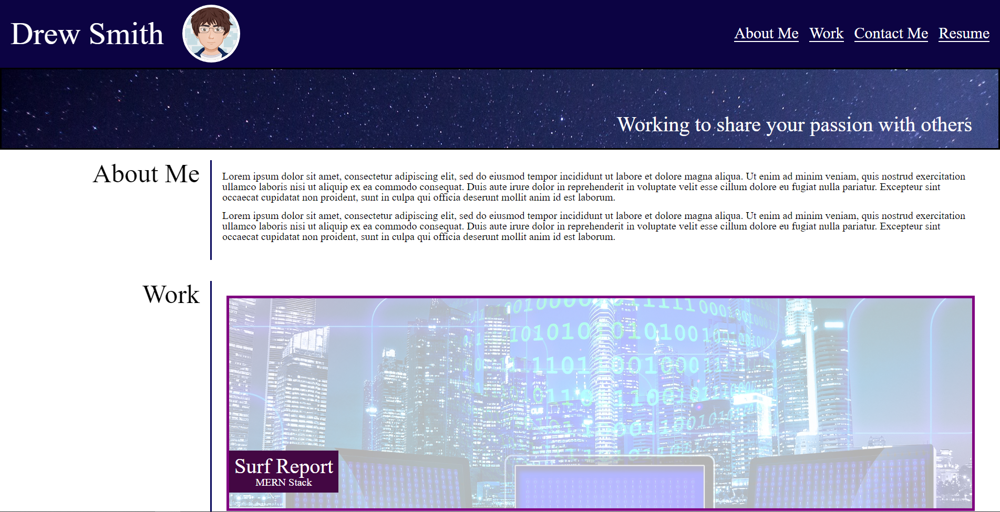

# Portfolio
[Link to the Web App](https://ds055.github.io/portfolio/)

## Description
This website serves as a portfolio of my work for prospective employers. It showcases some of my best projects, provides contact information, and links to some personal pages to help visitors get a sense of who I am. 

## Screenshot

## Installation
N/A

## Usage
* Users will arrive at the website--perhaps discovered via a search engine.
* Links at the top will forward users further down the page to the selected section.
* The Resume link will open up my resume in a new window. (There is a placeholder now.)
* The Work section houses pictures that link to samples of my work. (There are placeholder links now.)
* The Contact Me section provides telephone, email, GitHub, Twitter, and Spotify pages. 

## License
Please refer to the license in the repo.

- - -

### Special Notes

- Please excuse the placeholder links--as mentioned above.

- Hero image from Pixabay, [which can be found here](https://pixabay.com/photos/stars-milky-way-night-sky-blue-sky-1869692/), using the Pixabay Licencse.

- Surf Report image from Pixabay, [which can be found here](https://pixabay.com/illustrations/monitor-binary-binary-system-1307227/), using the Pixabay Licencse.

- LED Wall image from Pixabay, [which can be found here](https://pixabay.com/illustrations/bright-empty-modern-ray-render-4427933/), using the Pixabay Licencse.

- Calculator image from Pixabay, [which can be found here](https://pixabay.com/illustrations/geometry-mathematics-dice-1023846/), using the Pixabay Licencse.

- Pastel Puzzels image from Pixabay, [which can be found here](https://pixabay.com/illustrations/computer-monitor-waves-colorful-1373684/), using the Pixabay Licencse.

- Run Buddy image from Pixabay, [which can be found here](https://pixabay.com/photos/optical-ilusion-illusion-3046735/), using the Pixabay Licencse.

- Resume Samples PDF [retrieved from this site](https://msnlabs.com/img/resume-sample.pdf). 
